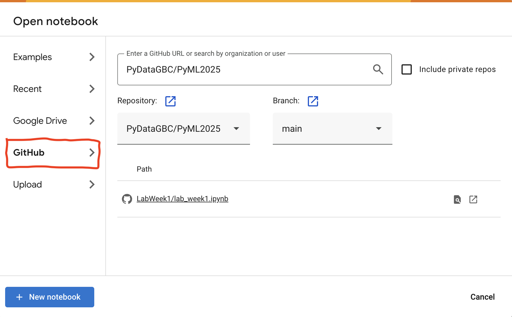

### Running the Notebook as ...
You have multiple options for running this code:

### Google Colab notebook:
1. [Google Colab](https://colab.research.google.com/) (Right-click and select "Open link in new tab").
2. Upload the notebook by following the steps illustrated in the image below.

<br>




### Saving and Downloading Your Notebook

After completing your work, save or download the notebook by clicking **File** menue in Google Colab.  


OR

## Running Cloning the course repository on your local machine

Clone the repository in the directory. 
```bash
git clone https://github.com/PyDataGBC/PyData2025.git
```

Then navigae to the cloned repository and open the notebooks is VS Code. 
```bash
cd PyData2025
```

### Submission:
### Submitting Your Solution to D2L

Upload the `.ipynb` file as your solution.  

**Setting up a Python environment in VSCode** 

Watch this [video](https://drive.google.com/file/d/1la5G4q_cjCHWU4myUb5CH_rpaXdbKCG7/view?usp=sharing) to create a jupyter notebook in VS Code and run it locally in a virtual environment.

**Note:** For Mac users python will be installed after adding python extension to VS Code. For Windows users, if python is not installed, download and install it from Microsoft Store.
